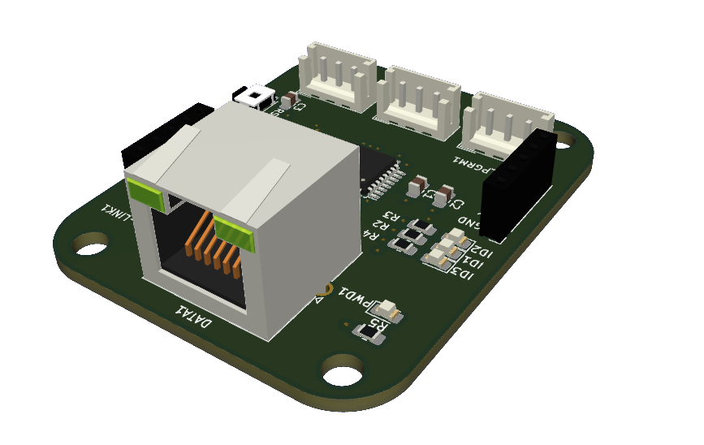

# Changelog

## Pedals PCB

### Outcome (Version 1)

### Key Issues with Version 1

1. The connectors used are difficult to handle and require meticulous assembly for proper functioning.

2. The buttons used for **Reset** and **Boot** are very small, making them difficult to access when a case is used.

3. The MCU's **HAL** API has unresolved issues, especially concerning analog readings.

4. Debugging and programming ports are not efficiently distributed.

5. Despite having a maximum resolution of 14 bits, it suffers from noise that interferes with readings, resulting in a poor gaming experience.

6. When updating the firmware, it cannot be achieved without physically pressing the buttons.

### Troubleshooting for Version 1

1. Replace the connectors used with "pin sockets" and add a soldering pad for direct cable connection, along with the necessary silk-screen markings.

2. Choose taller buttons and position them in an easily accessible area.

3. Use the LL (Low Level) layer for more precise control of analog readings.

4. Rearrange the ports to a more accessible location, such as placing them side by side.

5. Implement software filtering.

6. Connect the Reset and Boot inputs to the RJ45 port.

### Improvements (Newly Added Components)

- 8-channel multiplexer with ADC.

- Hardware for 3 load cells.
	- Possible load cell model [Aliexpress](https://es.aliexpress.com/item/1005004518830741.html).

- Add pins for SPI and I2C connections.

- USB Type-C.

- New, more powerful microcontroller (STM32F0 family) with HID support, potentially allowing it to function without the main board.

### Outcome (Version 2)

