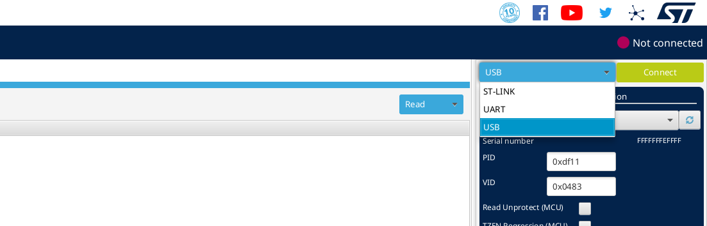

# Firmware

## Frameworks (ESP-IDF and STM32CubeIDE)

Each microcontroller uses its respective framework:

- STM32xx: **STM32CubeIDE**
- ESP32xx: **ESP-IDF**

To compile the firmware for ESP32-S3, a Docker container provided by Espressif is used, using the **latest** version.

[You can find information related to Espressif's Docker here](https://docs.espressif.com/projects/esp-idf/en/latest/esp32/api-guides/tools/idf-docker-image.html?highlight=docker)

[Here are the instructions for generating the container](https://hub.docker.com/r/espressif/idf/tags)

Currently, only esp-idf has a container. To compile for STM32 microcontrollers, STM32CubeIDE is necessary.

## Firmware Update (STM32F072RBT6)

The STM32F072RBT6 allows firmware updates in three possible ways:

- USB through DFU
- UART on pins (PA14/PA15 or PA9/PA10)
- I2C on pins (PB6/PB7)

For more information, you can visit the [datasheet](https://datasheet.lcsc.com/lcsc/1809301214_STMicroelectronics-STM32F072RBT6_C46046.pdf#page=13).

To update the firmware for this version, you can use USB-DFU (Connecting the USB-TypeC)
or the UART port located at the expansion port.

**Note: If you want to update through UART, another board is required to connect via 
FFC connector.**

To put the microcontroller into firmware update mode, you need to follow the pattern # 2 as mentioned in document [AN2606](https://www.st.com/resource/en/application_note/an2606-stm32-microcontroller-system-memory-boot-mode-stmicroelectronics.pdf).

|Pattern|Condition|
|-|-|
|Pattern 2|Boot0(pin) = 1 and nBoot1(bit) = 1|

This means that you just need to press the button labeled as **BOOT**, while ensuring 
that the option bit **nBoot1** remains set to 1. This bit can be set in the code or 
through the STM32CubeProgrammer IDE.

### Tools Required for Firmware Update

#### Software

- [STM32CubeProgrammer](https://www.st.com/en/development-tools/stm32cubeprog.html)

#### Hardware

- USB-TypeC cable

- USB-TTL Bridge(In the case of UART connection method) 

### Steps to Update the Firmware (Using USB-TypeC)

1. Connect the USB-C cable to the PCB

2. Connect the USB-C cable to your PC while pressing the **RESET and BOOT** buttons.

3. Open STM32CubeProgrammer.

4. Select USB at the top right.

5. Select the Port in this case is USB1

6. Press the green **Connect** button.

7. Navigate to the tab as indicated below:

9. Locate the path of the **.elf** file and press **Start Programming**:

10. Press RESET, and it should now work with the new firmware.
