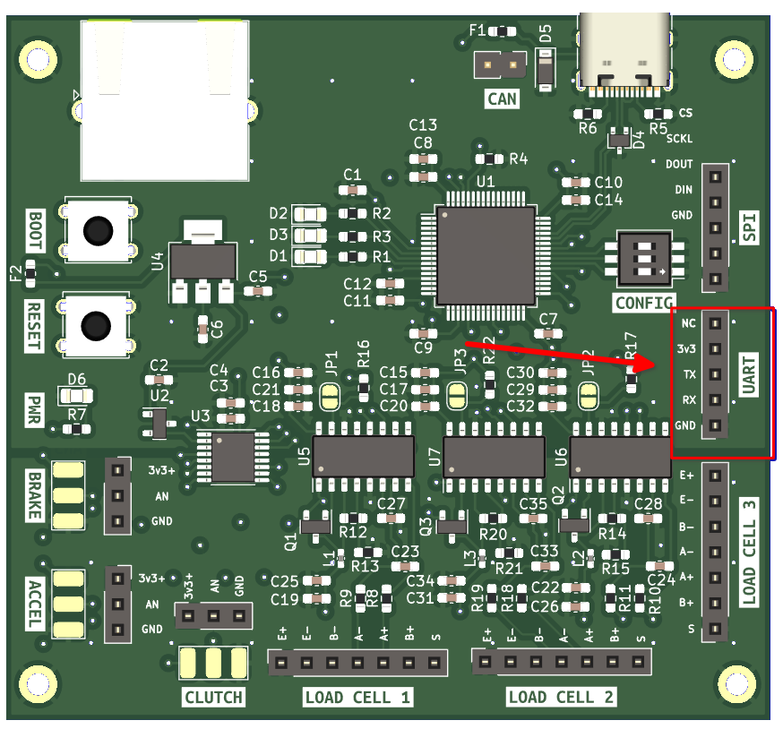
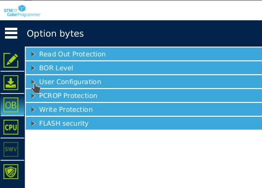
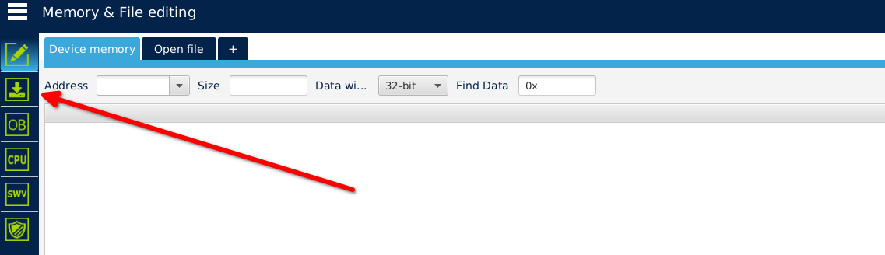
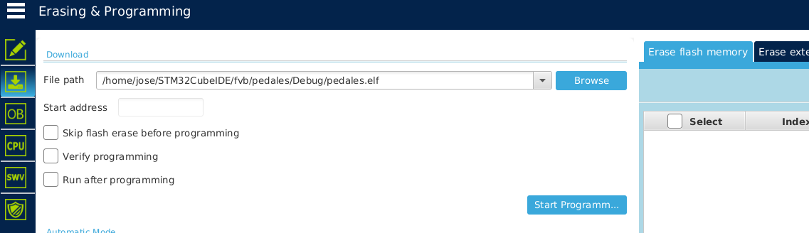

# Firmware

## Actualización de firmware(STM32F072RBT6)
El STM32F072RBT6 permite cargar el firmware de 3 maneras posibles

- USB por DFU
- UART en pines (PA14/PA15 o PA9/PA10)
- I2C en pines (PB6/PB7)

Para mas información puedes visitar la 
[hoja de datos](https://datasheet.lcsc.com/lcsc/1809301214_STMicroelectronics-STM32F072RBT6_C46046.pdf#page=13)

La forma de actualizar el firmware para esta versión, es através de UART,
el puerto se encuentra aquí

Para que el Microcontrolador entre en modo de actualización de firmware es necesario
cumplir con un patrón , estos se encuentran en el documento **AN2606**

**Página 62** 

El cual menciona que el _bootloader_ es activado aplicando el **patrón 6**

**Tabla 21**

La primera opción que muestra la tabla es la que se puede seguir si no se cuenta con
el  programdor [ST-LINK](https://www.st.com/en/development-tools/st-link-v2.html), 
además que no se añadio ese puerto.

El cambio que se requiere hacer en el programa STM32CubeProgrammer es el siguiente:

1. Ir a la pestaña **OB**

2. User configuration

3. Buscar la casilla y modificar el valor nBoot0_SW(bit)

### Herramientas necesarias para actualizar el firmware

#### Software

- [STM32CubeProgrammer](https://www.st.com/en/development-tools/stm32cubeprog.html)

#### Hardware

- Puente USB-UART _(Ejemplo: USB UART CP2102)_

### Pasos para actualizar el firmware

Conecta el puerto UART al puente USB-UART de la siguiente manera:

|PCB (UART)| Puente USB-UART|
|-|-|
|GND|GND|
|TX|RX|
|RX|TX|
|3v3|3v3(opcional)|

2. Conecta el Puente USB-UART a tu PC mientras presionas los botones de **RESET y BOOT**

3. Abre STM32CubeProgrammer

4. Selecciona UART en la parte superior derecha

5. Selecciona el puerto usb donde conectaste el puente USB-UART, en Linux suele 
llevar el nombre de **/dev/ttyUSBx** y en Windows **COMx**

6. Presionar el bóton verde de **Connect**

7. **IMPORTANTE:** Realizar los pasos la activación del carga de firmware estos los
encuentras 
[aquí](#actualizacion-de-firmware), si no sigues este paso, no podrás actualizar el
firmware en un futuro.
8. Seleccionar la pestaña que se señala a continuación

9. Buscar la ruta de del archivo **.elf** y presionar Start Programming

10. Presiona RESET y ya debería de funcionar con el nuevo firmware

