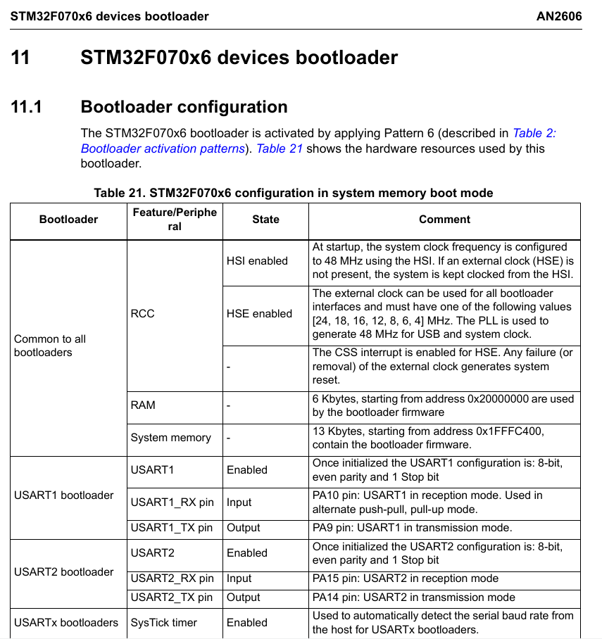

# Firmware

## Frameworks (ESP-IDF and STM32CubeIDE)

Each microcontroller uses its respective framework:

- STM32xx: **STM32CubeIDE**
- ESP32xx: **ESP-IDF**

To compile the firmware for ESP32-S3, a Docker container provided by Espressif is used, using the **latest** version.

[You can find information related to Espressif's Docker here](https://docs.espressif.com/projects/esp-idf/en/latest/esp32/api-guides/tools/idf-docker-image.html?highlight=docker)

[Here are the instructions for generating the container](https://hub.docker.com/r/espressif/idf/tags)

Currently, only esp-idf has a container. To compile for STM32 microcontrollers, STM32CubeIDE is necessary.

## Firmware Update (STM32F072RBT6)

The STM32F072RBT6 allows firmware updates in three possible ways:

- USB through DFU
- UART on pins (PA14/PA15 or PA9/PA10)
- I2C on pins (PB6/PB7)

For more information, you can visit the [datasheet](https://datasheet.lcsc.com/lcsc/1809301214_STMicroelectronics-STM32F072RBT6_C46046.pdf#page=13).

To update the firmware for this version, you must use UART. The port is located here:

To put the microcontroller into firmware update mode, you need to follow a pattern as mentioned in document **AN2606**.

**Page 62**

It mentions that the bootloader is activated by applying **pattern 6**.

**Table 21**

The first option shown in the table can be followed if you do not have the [ST-LINK programmer](https://www.st.com/en/development-tools/st-link-v2.html) and if that port has not been added.

The change required in the STM32CubeProgrammer program is as follows:

1. Go to the **OB** tab.

2. User configuration.

3. Find the box and modify the value nBoot0_SW(bit).

### Tools Required for Firmware Update

#### Software

- [STM32CubeProgrammer](https://www.st.com/en/development-tools/stm32cubeprog.html)

#### Hardware

- USB-UART Bridge _(Example: USB UART CP2102)_

### Steps to Update the Firmware

Connect the UART port of the PCB to the USB-UART bridge as follows:

| PCB (UART) | USB-UART Bridge |
| - | - |
| GND | GND |
| TX | RX |
| RX | TX |
| 3v3 | 3v3 (optional) |

2. Connect the USB-UART Bridge to your PC while pressing the **RESET and BOOT** buttons.

3. Open STM32CubeProgrammer.

4. Select UART at the top right.

5. Select the USB port where you connected the USB-UART bridge. In Linux, it often has the name **/dev/ttyUSBx**, and in Windows, it's usually **COMx**.

6. Press the green **Connect** button.

7. ⚠️**IMPORTANT**⚠️ Perform the firmware loading activation steps, which you can find [here](#firmware-update). If you skip this step, you won't be able to update the firmware in the future.

8. Select the tab as indicated below:

9. Locate the path of the **.elf** file and press **Start Programming**:

10. Press RESET, and it should now work with the new firmware.
