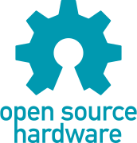

# Bienvenido a la documentación de CAE32

Puedes visitar el [repositorio](https://github.com/janc18/CAE32)
para acceder a todos los recursos.

## CAE32

CAE32 es un proyecto de código abierto bajo la licencia
[GPLv3](https://www.gnu.org/licenses/quick-guide-gplv3.html), 
que tiene como objetivo proporcionar todos los elementos necesarios para lograr
disfrutar de juegos de simulación, principalmente en el área automovilística pero
nada impide que sea usada para otra área.

## Componentes

- Hardware:
	- Pedales
	- Palanca de cambios _(Shifter)_
	- Volante _(Steering Wheel)_
- Firmware

- GUI(GTK3)

## Hardware

El Hardware de este proyecto es Open Source Hardware,
[aquí](https://github.com/janc18/CAE32/tree/main/Esquematicos/CAE32_PCB)
encontrarás todos los archivos relacionados al desarrollo del Hardware, el Software usado
es [KiCad](https://www.kicad.org/)

La idea del hardware de CAE32 es que sea lo mas modular posible.

**Ejemplo**

- La PCB de los pedales es posible usarla en conjunto con la placa principal o sin ella,
ya que esta cuenta con capacidad HID(Human Interface Device).

- Perifericos _(SPI, UART, CAN)_ expuestos para añadirle mas capacidades.

Visita la categoría Hardware para obtener mas información

## Firmware

El Firmware se desarrolla con el Framework proporcionado por el fabricante:

- ESPIDF 

- STM32CubeIDE 

Ademas se implementa en ambos FreeRTOS para una mayor facilidad de programación

Visita [aquí](./firmware.md) para mas información.

## GUI

Para configurar cada una de las características de manera intuitiva, se crea una GUI con
la resulta relativamente facil modificar el comportamiento de ciertas funciones.

La GUI esta construida en el framework de GTK3.

