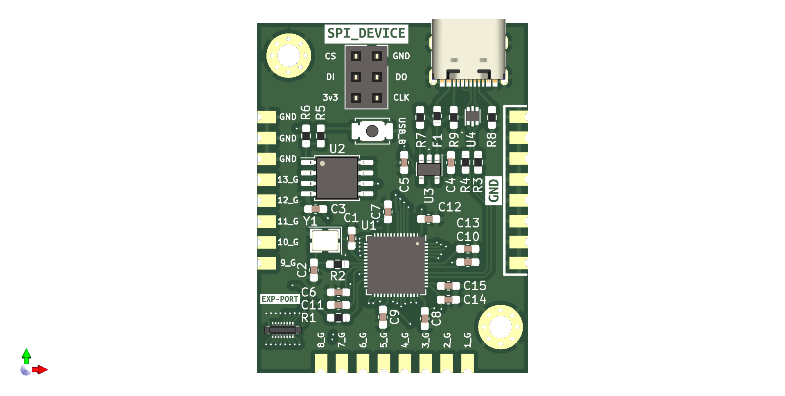
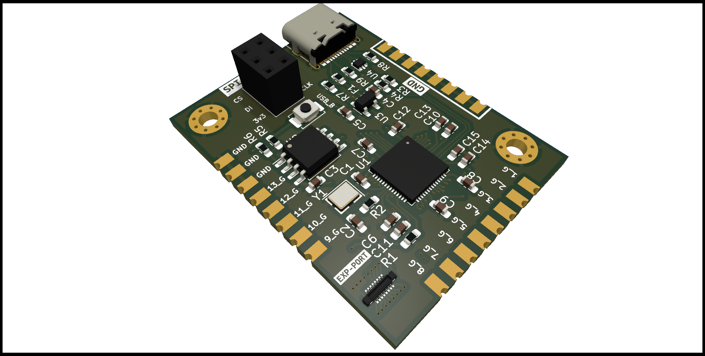
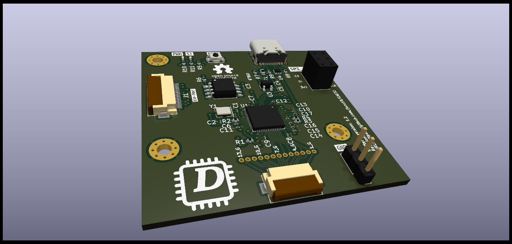

# Gear Shift _(Shifter)_

This PCB has the least degree of design complexity since it only needs to read the digital signal from sensors, which can be:

- Buttons (Push, switches, toggles, etc.)
- Hall effect sensors
- Any others that produce high and low signals

This PCB will only include:

- Main microcontroller (with USB HID capabilities)
- 13 digital inputs, one for each gear
- USB-C port and RJ45 port

## Current Status

### Version 1.1

I decided to use the RP2040 microcontroller, as mentioned earlier, since only an MCU with HID capabilities is required. When compared to the price of any MCU from the Espressif family, the RP2040 is considerably cheaper.

Another change made was to replace the RJ45 port with "Pin Sockets" to reduce space.

Additionally, 13 inputs for the gears are added instead of 10 inputs.

Lastly, the PCB is given a module format with the use of castellated pins so that this core (this PCB, as it contains the MCU) can be changed in the future. Furthermore, to make the RP2040 utilize all its pins, a Mezzanine port is added to the top layer.

### Version 1.2

**Note:** In the case that you don't want to use the FPC connector to
connect the inputs of the gear, you can use the exposed pins
to connect directly to the PCB.

- Changed via diameter from 0.15mm to 0.3mm to reduce PCB
manufacturing costs.

- Moved the boot button to a more accessible location.

- Replaced Castellated holes with FPC connectors (input pins
from the gears and expansion port).

- Added a few GND pins to complete the digital circuit 
from the input device(buttons, Hall sensors, etc).

- Added Power and status LED indicator

- Added silkscreen with the PCB details

