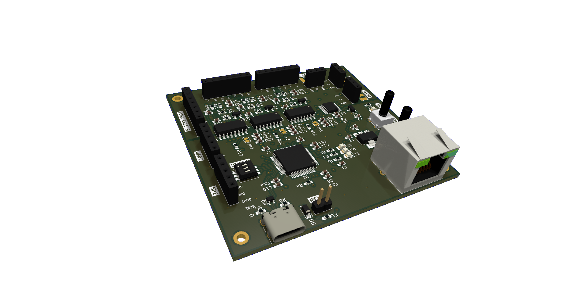
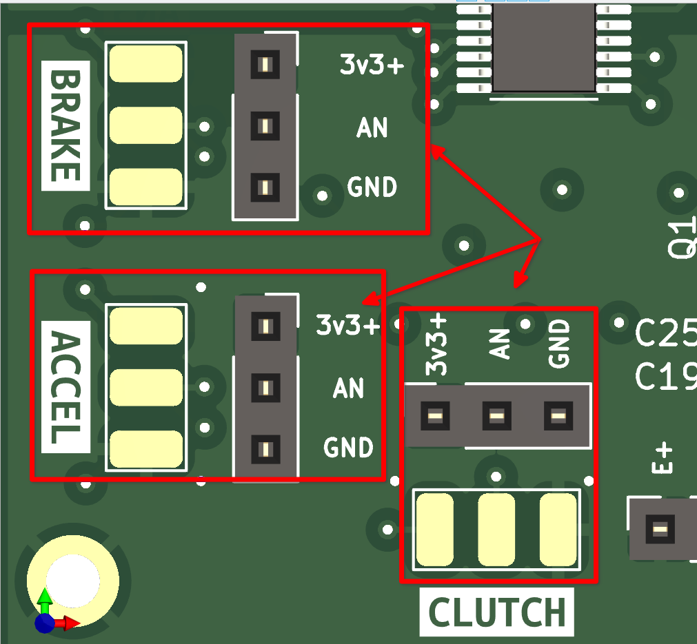
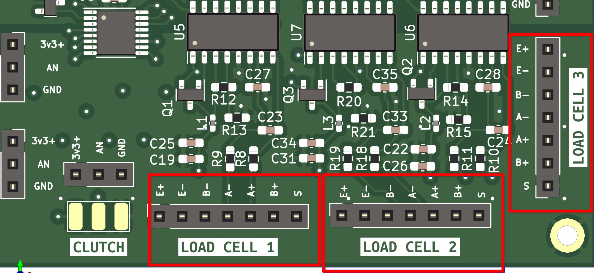

# PCB pedales

## Versión:2, Revisión:1

## Características

- [8 Entradas analógicas](#entradas-analogicas-adc128s102)
- [3 Entradas para celdas de carga](#celdas-de-carga)
- UART _(Para actualizar firmware o algún otro uso)_
- SPI
- CAN _(No cuenta con transductor)_
- Puerto USB-C para comunicación con PC
- Puerto RJ45 para conectarse a la placa principal

## Propósito de PCB
Usarse para capturar la posición de los pedales con sus 8 canales analógicos y soporte
para celdas de cargas

## Esquema eléctrico 

[Ver PDF](./pdfs/kicad_schematic.pdf)

## Componentes principales

|Nombre|Cantidad|Hoja de datos|
|-|-|-|
|STM32F072RBT6|1|[Link](https://datasheet.lcsc.com/lcsc/1809301214_STMicroelectronics-STM32F072RBT6_C46046.pdf)|
|ADC128S102|1|[Link](https://datasheet.lcsc.com/lcsc/2304140030_Texas-Instruments-ADC128S102CIMTX-NOPB_C179666.pdf)|
|HX711|3|[Link](https://cdn.sparkfun.com/datasheets/Sensors/ForceFlex/hx711_english.pdf)|

## Entradas analógicas _(ADC128S102)_

Para adquirir la posición de los sensores _(potenciómetros, efecto hall, etc.)_
se usa el IC ADC128S102, el cual es un multiplexador de 8 canales que integra un 
ADC de **12 bits**, con lo que se obtiene una resolución de **4096** posiciones, este
se encuentra conectado por **SPI** al Microcontrolador(STM32F072RBT6).

La PCB cuenta con etiquetas como **ACCEL, BRAKE, CLUTCH, AN4-AN8**.

Las cuales por lógica **ACCEL, BRAKE, CLUTCH** corresponde a las entradas de sensores 
por defecto, mientras que **AN4-AN8** se pueden usar para cualquier otro propósito.

Cada una de las entradas donde se soldará el sensor _(potenciómetro, etc)_ cuenta con 
3 pines con su respectiva etiqueta, esto tambien se aplica a sus mismos pads.

Para tener un valor de referencia mas estable, se agrega un integrado de voltage de
referencia [REF3033](http://www.ti.com/lit/ds/symlink/ref3033.pdf) de 3.3V con lo cual
puede obtener lecturas mas estables

|Nombre de Etiqueta|Significado|
|-|-|
|3v3+|Aquí se alimenta el sensor con 3.3V|
|AN|Salida del sensor analógico|
|GND|Tierra|

### Precauciones

**Es tu responsabilidad verificar las conexiones de los sensores a usar**

1. No cuenta con protección contra polaridad inversa(conectar al revés GND y 3v3)

2. No cuenta con protección contra sobrecarga

## Celdas de carga

Cuenta con soporte para 3 celdas de carga.

El diseño esta basado en el diagrama creado por Digikey y se agregó una modificación, la
cual se explica en el diagrama.
**SparkFun_HX711_Load_Cell_V11**

**Design by: N.Seidle**

**License:CC BY-SA 4.0**

Cada uno de los puertos para las celulas de carga esta etiquetado, además de contar con
la simbología típica, pero todo depende de la celda de carga elegida.

Para mas información recomiendo ver el diagrama eléctrico
[aquí](./pdfs/kicad_schematic.pdf#page=5) lo puedes encontrar

## Modo device(SPI)
Esta versión de pedales puede funcionar como **dispositivo**, ya que el conector RJ45
esta conectado al Microcontrolador por SPI, esto para enviar todos los datos a la placa
principal.

## Modo device(USB-C)
Permite que el Microcontrolador STM32F072RBT6 actue como un dispositivo HID, por lo cual
sera reconocido como un _Joystick_ por la PC

## Notas de los modos anteriores

**SPI**

Al conectarlo por el puerto RJ45, este es sumistrado con alimentación así 
que no debe de conectarse el puerto USB-C.

Además los datos que son adquiridos por la PCB, se envian por el protocolo SPI
a la PCB principal.

**USB-C**

La configuración del puerto USB-C esta en modo dispositivo, de esa manera el host(PC) 
suministrará la alimentación y se mostrará como un dispositivo HID

Además cuenta con dos resistencia en _Pulldown_ conectado en **CC1 y CC2** de 5.1K ohms,
con lo cual en teoría el host podria entregar hasta 1.5 Amperes de corriente, aunque la 
PCB consume aproximadamente 320 mA, quizá para la siguiente versión se agrege 
capacidades de PD _(PowerDelivery)_.

## ¿Comó obtengo acceso a la PCB?

Por el momento la unica forma es con un provedor de PCB como JLCPCB, PCBWay etc,
subiendo el archivo gerber.

Los archivos gerber y BOM se estaran publicando en _releases_ en el 
[repositorio](https://github.com/janc18/CAE32).

También tienes acceso a los esquematicos para cualquier modificación, [aquí](https://github.com/janc18/CAE32/tree/main/Esquematicos/CAE32_PCB/Pedals/Pedals)

**Datos relevantes de PCB**

- 4 capas

- Dimensiones: 70mm x 76mm

