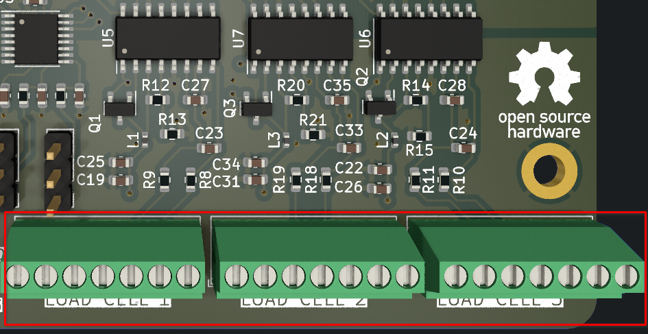

# Pedals PCB

## Version: 2, Revision: 1

This PCB has a medium level of difficulty, mainly due to the routing of the analog part of the PCB.

## Features

- [8 Analog Inputs](#analog-inputs-adc128s102)
- [3 Inputs for Load Cells](#load-cells)
- UART _(For firmware updates or other purposes)_
- SPI
- CAN _(No transducer included)_
- USB-C port for communication with PC
- RJ45 port to connect to the main board

## PCB Purpose
It is used to capture the position of the pedals with its 8 analog channels and support for load cells.

## Electrical Schematic 

[View PDF](./pdfs/kicad_schematic.pdf)

## Key Components

|Name|Quantity|Datasheet|
|-|-|-|
|STM32F072RBT6|1|[Link](https://datasheet.lcsc.com/lcsc/1809301214_STMicroelectronics-STM32F072RBT6_C46046.pdf)|
|ADC128S102|1|[Link](https://datasheet.lcsc.com/lcsc/2304140030_Texas-Instruments-ADC128S102CIMTX-NOPB_C179666.pdf)|
|HX711|3|[Link](https://cdn.sparkfun.com/datasheets/Sensors/ForceFlex/hx711_english.pdf)|

## Analog Inputs _(ADC128S102)_

To acquire the position of the sensors (potentiometers, Hall effect, etc.), the ADC128S102 IC is used, which is an 8-channel multiplexer that integrates a **12-bit** ADC, providing a resolution of **4096** positions. It is connected via **SPI** to the microcontroller (STM32F072RBT6).

The PCB has labels such as **ACCEL, BRAKE, CLUTCH, AN4-AN8**.

By default, **ACCEL, BRAKE, CLUTCH** correspond to the default sensor inputs, while **AN4-AN8** can be used for any other purpose and are located on the back of the PCB.

Each of the sensor input points (e.g., potentiometer) has 3 pins with their respective labels, and this also applies to their respective pads.

|Label Name|Meaning|
|-|-|
|3v3+|Here, the sensor is powered with 3.3V|
|AN|Analog sensor output|
|GND|Ground|

To provide a more stable reference voltage, a 3.3V voltage reference integrated circuit [REF3033](http://www.ti.com/lit/ds/symlink/ref3033.pdf) is added to the PCB, which allows for more stable readings.

### Precautions

**It is your responsibility to verify the connections of the sensors you intend to use**

1. There is no protection against reverse polarity (reversed connection of GND and 3v3).

2. There is no protection against overload.

## Load Cells

It supports 3 load cells.

The design is based on the diagram created by Digikey, with an added modification explained in the diagram. **SparkFun_HX711_Load_Cell_V11**

**Design by: N.Seidle**

**License: CC BY-SA 4.0**

Each of the ports for the load cells is labeled, and they have typical symbols, but it all depends on the chosen load cell.

For more information, I recommend referring to the electrical diagram [here](./pdfs/kicad_schematic.pdf#page=5), where you can find it.

## Device Mode (SPI)
This version of the pedals can function as a **device** because the RJ45 connector is connected to the Microcontroller via SPI. This is done to send all data to the main board.

## Device Mode (USB-C)
It allows the STM32F072RBT6 Microcontroller to act as a HID (Human Interface Device), which means it will be recognized as a joystick by the PC.

## Notes on the Above-Mentioned Modes

**SPI**

When connecting via the RJ45 port, it is supplied with power, so you should not connect the USB-C port.

Additionally, the data acquired by the PCB is sent through the SPI protocol to the main PCB using the RJ45 port.

**USB-C**

The USB-C port configuration is in device mode. This way, the host (PC) will provide power, and it will be recognized as a HID device.

Furthermore, it has two pull-down resistors connected to **CC1 and CC2**
