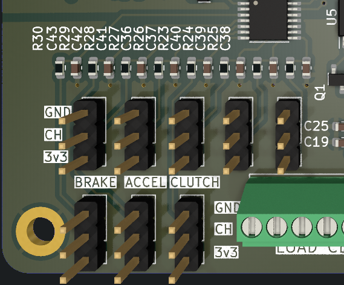

# PCB pedales

## Versión:2, Revisión:1

## Características

- [8 Entradas analógicas](#entradas-analogicas-adc128s102)
- [3 Entradas para celdas de carga](#celdas-de-carga)
- UART _(Para actualizar firmware o algún otro usó)_
- SPI
- CAN _(No cuenta con transductor)_
- Puerto USB-C para comunicación con PC
- Puerto RJ45 para conectarse a la placa principal

## Esquema eléctrico 

[Ver PDF](./pdfs/kicad_schematic.pdf)

## Componentes principales

|Nombre|Cantidad|Hoja de datos|
|-|-|-|
|STM32F072RBT6|1|[Link](https://datasheet.lcsc.com/lcsc/1809301214_STMicroelectronics-STM32F072RBT6_C46046.pdf)|
|ADC128S102|1|[Link](https://datasheet.lcsc.com/lcsc/2304140030_Texas-Instruments-ADC128S102CIMTX-NOPB_C179666.pdf)|
|HX711|3|[Link](https://cdn.sparkfun.com/datasheets/Sensors/ForceFlex/hx711_english.pdf)|

## Entradas analógicas _(ADC128S102)_

Para adquirir la posición de los sensores _(potenciómetros, efecto hall, etc.)_
se usa el IC ADC128S102, el cual es un multiplexador de 8 canales que integra un 
ADC de **12 bits**, con lo que se obtiene una resolución de **4096** posiciones, este
se encuentra conectado por **SPI** al Microcontrolador(STM32F072RBT6).

La PCB cuenta con etiquetas como **ACCEL, BRAKE, CLUTCH, AN4-AN8**.

Las cuales por lógica **ACCEL, BRAKE, CLUTCH** corresponde a las entradas de sensores 
por defecto, mientras que **AN4-AN8** se pueden usar para cualquier otro propósito.

Cada una de las entradas donde se soldará el sensor _(potenciómetro, etc)_ cuenta con 
3 pines con su respectiva etiqueta, esto tambien se aplica a sus mismos pads.

Para tener un valor de referencia mas estable, se agrega un integrado de voltage de
referencia [REF3033](http://www.ti.com/lit/ds/symlink/ref3033.pdf) de 3.3v con lo cual
puede reducir el ruido

|Nombre de Etiqueta|Significado|
|-|-|
|3v3+|Aquí se alimenta el sensor con 3.3 voltios|
|AN|Salida del sensor analógico|
|GND|Tierra/GND|

### Precauciones

**Es tu responsabilidad verificar las conexiones de los sensores a usar**

1. No cuenta con protección contra polaridad inversa(conectar al revés gnd y 3v3)

2. No cuenta con protección contra sobrecarga

## Celdas de carga
