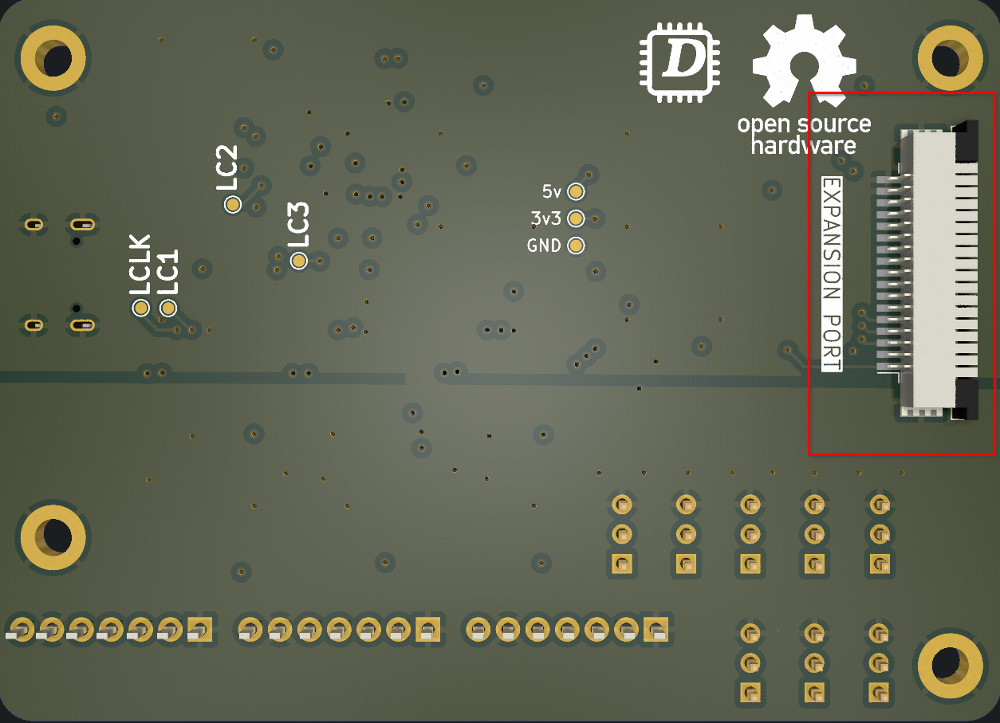

# Pedals PCB

## Version: 2.1 Revision: 1

## Features

- [8 Analog Inputs](#analog-inputs-adc128s102)
- [3 Inputs for Load Cells](#load-cells)
- Extension Port
    - UART _(For firmware updates or other purposes)_
    - 2 x SPI
    - CAN _(No transducer included)_
- USB-C port for communication with PC and firmware updates

## PCB Purpose
It is used to capture the position of the pedals with its 8 analog channels and support for load cells.

## Electrical Schematic 

[View PDF](./pdfs/PedalsV_2.1.1.pdf)

## Key Components

|Name|Quantity|Datasheet|
|-|-|-|
|STM32F072RBT6|1|[Link](https://datasheet.lcsc.com/lcsc/1809301214_STMicroelectronics-STM32F072RBT6_C46046.pdf)|
|ADC128S102|1|[Link](https://datasheet.lcsc.com/lcsc/2304140030_Texas-Instruments-ADC128S102CIMTX-NOPB_C179666.pdf)|
|HX711|3|[Link](https://cdn.sparkfun.com/datasheets/Sensors/ForceFlex/hx711_english.pdf)|

## Analog Inputs _(ADC128S102)_

To acquire the position of the sensors (potentiometers, Hall effect, etc.), the ADC128S102 IC is used, which is an 8-channel multiplexer that integrates a **12-bit** ADC, providing a resolution of **4096** positions.

The PCB has labels such as **ACCEL, BRAKE, CLUTCH and CH**.

By default, **ACCEL, BRAKE, CLUTCH** correspond to the default sensor inputs, while the row above are the channels that can be used for any other purpose 

|Label Name|Meaning|
|-|-|
|3v3+|3.3v Output|
|CH|Analog sensor|
|GND|Ground|

To provide a more stable reference voltage, a 3.3V voltage reference integrated circuit [REF3033](http://www.ti.com/lit/ds/symlink/ref3033.pdf) is added to the PCB, which allows for more stable readings.

### Precautions

**It is your responsibility to verify the connections of the sensors you intend to use**

1. There is no protection against reverse polarity (reversed connection of GND and 3v3).

2. There is no protection against overload.

## Load Cells

It supports 3 load cells.

The design is based on the diagram created by Digikey, with an added modification explained in the diagram. **SparkFun_HX711_Load_Cell_V11**

**Design by: N.Seidle**

**License: CC BY-SA 4.0**

Each of the ports for the load cells is labeled, and they have typical symbols, but it all depends on the chosen load cell.

For more information, I recommend referring to the electrical diagram [here](./pdfs/PedalsV_2.1.1.pdf#page=5).

## Expansion Port
The expansion port are connected to communications buses(UART,SPI and CAN), than can be
used for debugging purposes or to expand the capabilities.

## Device Mode (USB-C)
It allows the STM32F072RBT6 Microcontroller to act as a HID (Human Interface Device), which means it will be recognized as a joystick by the PC.
